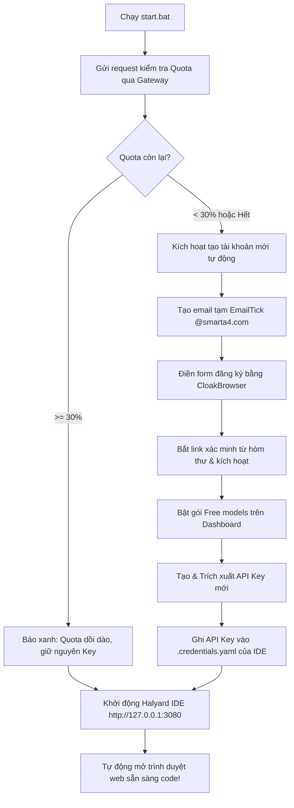

# deepseekfree

> **Bộ đôi hoàn hảo: IDE Halyard (DeepSeek Harness Web) tích hợp Bộ tự động quản lý Quota & Xoay Key Token Harbor miễn phí.**

---

## 🌟 Tính Năng Nổi Bật

### 1. IDE Halyard (DeepSeek Harness) Đã Tối Ưu & Tùy Biến
- **Giao diện Web IDE chuyên nghiệp:** Trực quan, chạy mượt mà trên trình duyệt tại `http://127.0.0.1:3080`.
- **Chế độ HACK CƠ LỎ (Uncensored / Full Mode):** 
  - Tích hợp công tắc bật/tắt ngay trên giao diện cài đặt tài khoản.
  - Khi bật, tự động nạp toàn bộ đặc tả vận hành `deepseek-4-1.md` vào System Prompt với độ ưu tiên cao nhất.
  - Hỗ trợ lệnh gọi tắt siêu nhanh trong khung chat: `/hack` hoặc `/deepseek-4-1`.
- **Trình duyệt thư mục Workspace thông minh:**
  - Mở thư mục trực tiếp in-browser, không bị lỗi ẩn cửa sổ Win32 dialog.
  - Mặc định duyệt từ toàn bộ ổ đĩa gốc `C:\` thay vì bị giới hạn trong User profile.
- **Bảo mật Skill:** Khóa cứng hệ thống, chặn các skill lạ bên ngoài (như `glm-5-3-flash`), chỉ cho phép đọc chỉ thị chuẩn từ `skills/`.

### 2. Bộ Quản Lý Quota & Tự Tạo Key Tự Động (`key/`)
- **Kiểm tra Quota thời gian thực:** Đọc trực tiếp % hạn mức sử dụng và thời gian reset qua API Gateway (mất chỉ 1-2 giây).
- **Cơ chế Ngưỡng 30% thông minh:**
  - Nếu Quota còn **>= 30%**: Báo xanh, tiếp tục sử dụng bình thường, không tốn tài nguyên tạo acc mới.
  - Nếu Quota còn **< 30%** (hoặc cạn kiệt/lỗi): Tự động kích hoạt luồng đăng ký mới.
- **Tạo acc & Xác minh Email 100% tự động:**
  - Tự tạo hòm thư tạm (EmailTick / InstantMail).
  - Tự điền form đăng ký bằng trình duyệt chống phát hiện CloakBrowser.
  - Tự bắt liên kết xác minh gửi về hộp thư và kích hoạt tài khoản.
  - Tự động bấm đồng ý điều khoản gói Free models trên Dashboard.
  - Tự tạo và trích xuất API Key mới (`thk_live_...`).
  - Toàn bộ chu trình hoàn tất chỉ trong **~71 giây**.
- **Tự động liên kết Key vào IDE:** Key mới được tự động ghi vào cấu hình của Halyard (`.credentials.yaml`), người dùng mở IDE lên là dùng được ngay, không cần copy thủ công.

---

## 📂 Cấu Trúc Dự Án

```text
deepseekfree/
├── setup.bat              # Script cài đặt tự động 1-click cho máy mới
├── start.bat              # Script khởi động tự động 1-click (Check Quota -> Sync Key -> Mở IDE)
├── README.md              # Tài liệu hướng dẫn sử dụng
│
├── ide/                   # Thư mục IDE Halyard
│   ├── package.json       # Danh sách dependencies của Halyard
│   ├── settings.yaml      # Cấu hình giao diện và model mặc định
│   ├── fun_mode.json      # Trạng thái công tắc HACK CƠ LỎ
│   ├── deepseek-4-1.md    # Bộ quy chuẩn vận hành Uncensored
│   ├── apply_patches.js   # Script tự động vá code vào node_modules
│   ├── patches/           # 6 bản vá tính năng đã được chỉnh sửa
│   └── skills/            # Thư mục chứa các Skill chuẩn (/hack, /deepseek-4-1)
│
└── key/                   # Thư mục Tool Quota & Key
    ├── check_and_rotate.py# Script kiểm tra Quota và tự tạo acc nếu dưới 30%
    ├── create_account_direct.py # Module đăng ký và xác minh email tự động
    ├── quota_manager.py   # Module quản lý danh sách tài khoản
    ├── temp_mail.py       # Module hòm thư tạm
    ├── check_quota.bat    # File bat kiểm tra nhanh Quota
    ├── force_create_acc.bat# File bat ép tạo acc mới ngay lập tức
    ├── requirements.txt   # Thư viện Python cần thiết
    ├── accounts.txt       # Danh sách tài khoản đã tạo
    └── key_acc1.txt       # API Key hiện hành
```

---

## 🚀 Hướng Dẫn Sử Dụng Trên Máy Mới (Clone về là chạy)

### Yêu cầu tiên quyết:
- **Windows 10/11**
- **Python 3.10+** (Tải tại [python.org](https://www.python.org/downloads/), nhớ tích chọn *"Add python.exe to PATH"*)
- **Node.js LTS** (Tải tại [nodejs.org](https://nodejs.org/))

### Bước 1: Clone kho mã nguồn về máy
```bash
git clone https://github.com/taitestgame/deepseekfree.git
cd deepseekfree
```

### Bước 2: Cài đặt tự động (Chỉ làm lần đầu)
Double-click chuột vào file:
👉 **`setup.bat`**

Chương trình sẽ tự động:
1. Cài đặt các thư viện Python (`pip install -r key/requirements.txt`).
2. Cài đặt các gói npm cho IDE (`npm install`).
3. Tự động áp dụng toàn bộ 6 bản vá tính năng vào nhân IDE.
4. Kiểm tra và cấp sẵn 1 API Key Token Harbor kích hoạt đầy đủ để sử dụng.

### Bước 3: Khởi động và sử dụng
Mỗi khi cần làm việc, chỉ cần double-click chuột vào file:
👉 **`start.bat`**

Hệ thống sẽ:
1. Kiểm tra Quota của Key hiện tại. Nếu dưới 30%, nó sẽ tự động tạo acc mới và cập nhật key vào IDE.
2. Khởi chạy máy chủ IDE Halyard tại `http://127.0.0.1:3080`.
3. Tự động mở trình duyệt web lên giao diện IDE để bạn bắt đầu làm việc ngay!

---

## ⚡ Cơ Chế Xoay Key Tự Động Hoạt Động Như Thế Nào?



---

## 📝 Bản quyền & Giấy phép
Dự án được phân phối cho mục đích nghiên cứu và phát triển cá nhân. Vui lòng tuân thủ điều khoản dịch vụ của các nền tảng liên quan.
